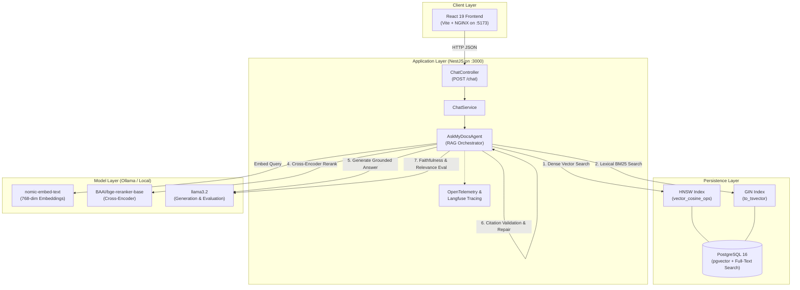

# Ask My Docs 📚

> A citation-grounded, production-engineered Retrieval-Augmented Generation (RAG) system with hybrid search, cross-encoder reranking, automated citation verification, and real-time LLM-as-a-judge factual evaluation.

[](https://github.com/Hukmaram/ask-my-docs/actions/workflows/ci.yml)
[](https://opensource.org/licenses/MIT)
[](https://www.typescriptlang.org/)
[](https://nestjs.com/)
[](https://github.com/pgvector/pgvector)
[](https://ollama.com/)

---

## Overview

General-purpose Large Language Models frequently suffer from hallucinations, stale training cutoff limits, and an inability to cite exact sources. **Ask My Docs** solves this by implementing an end-to-end domain-specific RAG system that answers user queries based strictly on ingested research literature (such as the foundational RAG, DPR, and REALM papers).

Every generated response is:
1. **Strictly Grounded**: Derived solely from retrieved chunks across the document corpus.
2. **Cited per Claim**: Formatted with precise citation markers (e.g. `[SOURCE_1]`).
3. **Verified & Repaired**: Evaluated for citation integrity with automatic sentence-level attribution propagation.
4. **Scored in Real-Time**: Judged on factual faithfulness and query relevance before reaching the user.

---

## Key Features

- **Document Ingestion & Chunking**: Sentence-aware PDF text extraction with token-based boundary controls and page number tracking using `pdfjs-dist` and `js-tiktoken`.
- **Hybrid Retrieval (Dense + Sparse)**: Combines dense vector similarity (`pgvector` with HNSW cosine distance index) and sparse lexical search (PostgreSQL `to_tsvector` with GIN indexing).
- **Reciprocal Rank Fusion (RRF)**: Merges rank positions across dense and lexical retrievers without requiring score normalization ($k=60$).
- **Cross-Encoder Reranking**: Re-scores candidate passages using `BAAI/bge-reranker-base` via `@huggingface/transformers` to maximize precision before prompt assembly.
- **Local LLM Inference**: Fully private local generation using `llama3.2` and embeddings via `nomic-embed-text` orchestrated through Ollama.
- **Automated Citation Validation & Repair**: Validates that citations exist and reference in-bounds sources; automatically repairs trailing uncited sentences.
- **Real-Time LLM-as-a-Judge**: Evaluates generation faithfulness (atomic claim extraction and premise entailment) and query relevance ($0.0 \to 1.0$).
- **End-to-End Observability**: Tracing for every stage (retrieval, reranking, generation, validation, evaluation) via OpenTelemetry and Langfuse.
- **Modern Web Application**: Responsive, glassmorphism-styled React 19 UI with real-time evaluation inspection, source viewer, and collapsible metrics.
- **Enterprise-Ready Infrastructure**: NestJS 12 backend architecture, multi-stage Docker Compose orchestration, automated tests, and GitHub Actions CI.

---

## Architecture



---

## RAG Pipeline

```
PDF Document
    │
    ▼
[ Sentence-Aware Chunking ] ──► (512 tokens, 64 token overlap)
    │
    ▼
[ Embedding Generation ] ─────► (nomic-embed-text / 768 dimensions)
    │
    ▼
[ PostgreSQL Storage ] ───────► (pgvector table + HNSW & GIN indices)
───────────────────────────────────────────────────────────────────────
User Query
    │
    ├─────────────────────────────┬─────────────────────────────┐
    ▼                             ▼                             ▼
[ Query Embedding ]     [ Dense Vector Search ]       [ PostgreSQL FTS ]
(nomic-embed-text)      (HNSW Cosine Distance)       (ts_rank_cd / English)
    │                             │                             │
    └─────────────────────────────┼─────────────────────────────┘
                                  ▼
                    [ Reciprocal Rank Fusion ] (Top 10 candidates, k=60)
                                  │
                                  ▼
                    [ BGE Cross-Encoder Reranker ] (Top 5 rescored)
                                  │
                                  ▼
                    [ Context Prompt Assembly ] (Top 2 sources selected)
                                  │
                                  ▼
                    [ Local LLM Generation ] (Ollama llama3.2)
                                  │
                                  ▼
                    [ Citation Validation & Repair ]
                                  │
                                  ▼
                    [ Faithfulness & Relevance Judges ]
                                  │
                                  ▼
                       Final Verified Response
```

---

## Retrieval Strategy

| Strategy | Engine | Strengths | Failure Mode |
| :--- | :--- | :--- | :--- |
| **Dense Vector** | `pgvector` (HNSW) | Captures semantic meaning, synonyms, conceptual queries | Misses exact jargon, acronyms, and specific IDs |
| **Lexical FTS** | PostgreSQL `tsvector` (GIN) | Exact keyword matching, rare terminology, identifier lookups | Fails on vocabulary mismatch or paraphrasing |
| **Rank Fusion** | Reciprocal Rank Fusion (RRF) | Combines positions ($1 / (60 + \text{rank})$) without score scale mismatch | Equal weight without deep cross-attention |
| **Reranking** | `bge-reranker-base` | Computes full cross-attention between query and chunk | Higher compute cost (run only on top candidates) |

---

## Evaluation & Quality Gates

Ask My Docs implements a multi-stage automated evaluation framework against a curated dataset of 15 canonical questions targeting knowledge-intensive NLP tasks (`golden-dataset.ts`).

### Evaluation Metrics

- **Retrieval Recall@5**: Evaluates whether gold-standard source chunks are present in the top-5 retrieved candidates across Vector, BM25, Hybrid, and Reranked stages.
- **Faithfulness**: LLM-as-a-judge extracts atomic claims from the generated answer and evaluates whether each claim is logically entailed by the retrieved source chunks.
- **Answer Relevance**: LLM-as-a-judge scores ($0.0 \to 1.0$) whether the generated response directly answers the user query without irrelevant tangents.
- **Citation Validity**: Evaluates whether all claims contain citations and whether all citation indices map strictly to valid retrieved sources.
- **Generation Pass Rate**: Ratio of test cases meeting all quality thresholds simultaneously.

### Quality Gate Thresholds

| Metric | Target Threshold | Mode |
| :--- | :--- | :--- |
| **Reranked Recall@5** | $\ge 80.0\%$ | CI Quality Gate |
| **Faithfulness** | $\ge 0.90$ | CI Quality Gate |
| **Answer Relevance** | $\ge 0.80$ | CI Quality Gate |
| **Citation Validity** | $100.0\%$ | CI Quality Gate |
| **Generation Pass Rate** | $\ge 80.0\%$ | CI Quality Gate |

> [!NOTE]
> Run the canonical evaluation runner locally via `npm run eval` or generate machine-readable artifacts via `npm run eval:json`.

---

## Observability

Every query triggers an OpenTelemetry distributed trace visualized in **Langfuse**:

- **Agent Span**: Overall latency, input query, and structured response payload.
- **Retrieval Span**: Individual vector, BM25, and hybrid candidate chunk IDs and counts.
- **Reranker Span**: Candidate IDs, BGE cross-encoder scores, and reordered rank.
- **Generation Span**: Prompt tokens, model parameters, and raw LLM completion.
- **Citation Spans**: Pre-repair validation status, repair transformations, and post-repair checks.
- **Evaluator Spans**: Extracted atomic claims, entailment verdicts, relevance explanation, and metric scores.

---

## API Reference

### 1. Health Check
```http
GET /health
```
**Response**:
```json
{
  "status": "ok"
}
```

### 2. Chat / Query Endpoint
```http
POST /chat
Content-Type: application/json
```
**Request Body**:
```json
{
  "query": "What are the two types of memory used by RAG?"
}
```
**Response Body**:
```json
{
  "answer": "RAG combines parametric and non-parametric memory for generation. [SOURCE_1] The parametric memory is a pre-trained sequence-to-sequence model, while the non-parametric memory is a dense vector index of Wikipedia accessed using a pre-trained neural retriever. [SOURCE_1]",
  "citations": ["SOURCE_1"],
  "citationValidation": {
    "valid": true,
    "citations": ["SOURCE_1"],
    "invalidCitations": [],
    "missingCitations": false,
    "uncitedSentences": []
  },
  "sources": [
    {
      "chunk": {
        "id": "2005.11401v4-chunk-0",
        "documentId": "2005.11401v4",
        "content": "Retrieval-Augmented Generation for Knowledge-Intensive NLP Tasks...",
        "chunkIndex": 0,
        "pageNumbers": [1, 2],
        "metadata": {}
      },
      "score": 0.01639344262295082,
      "rerankScore": 0.9812
    }
  ],
  "faithfulness": {
    "score": 1.0,
    "claims": [
      {
        "claim": "RAG combines parametric and non-parametric memory.",
        "entailed": true,
        "citation": "SOURCE_1"
      }
    ]
  },
  "relevance": {
    "score": 1.0,
    "explanation": "The answer directly and accurately answers the question regarding the two memory types."
  }
}
```

---

## Tech Stack

| Component | Technology | Version | Purpose |
| :--- | :--- | :--- | :--- |
| **Backend Runtime** | Node.js | `22.x` | Server-side JavaScript runtime |
| **API Framework** | NestJS | `12.0.1` | Modular architecture & dependency injection |
| **Database** | PostgreSQL + pgvector | `16.x` | Relational storage & HNSW vector search |
| **Lexical Search** | PostgreSQL FTS | Native | BM25-style full-text indexing (`GIN`) |
| **Local LLM & Embed** | Ollama | `llama3.2` / `nomic-embed-text` | Grounded generation & 768-dim embeddings |
| **Reranker** | BGE Reranker | `@huggingface/transformers` | Neural cross-encoder rescoring |
| **Frontend Framework** | React + Vite | `19.2.8` / `8.3.0` | High-performance SPA with fast HMR |
| **Web Server** | NGINX | Alpine | Lightweight production frontend server |
| **Observability** | OpenTelemetry + Langfuse | `5.11.1` | Distributed tracing and LLM evaluations |
| **Testing** | Node Native Test Runner | `node:test` | Isolated, zero-dependency unit tests |

---

## Project Structure

```
ask-my-docs/
├── .github/
│   └── workflows/
│       ├── ci.yml                 # Fast PR validation (typecheck, lint, tests, build)
│       └── rag-evaluation.yml     # Automated RAG evaluation & quality gate
├── config/
│   └── papers.yaml                # Curated research papers to ingest
├── data/
│   └── raw/                       # Downloaded raw PDF documents
├── docs/
│   └── ASK-MY-DOCS-HANDBOOK.md    # In-depth conceptual learning handbook
├── frontend/                      # React 19 + Vite frontend
│   ├── src/
│   │   ├── components/            # Answer, ChatInput, Sources, Evaluation
│   │   ├── services/              # API clients
│   │   └── App.tsx                # Main chat application interface
│   ├── Dockerfile                 # Multi-stage frontend Docker build
│   └── nginx.conf                 # Production SPA routing configuration
├── scripts/
│   ├── evaluation-runner.ts       # Canonical RAG evaluation test harness
│   ├── ingest.ts                  # PDF download, chunk, embed, and store pipeline
│   └── migrate.ts                 # Database schema migration runner
├── src/
│   ├── agent/                     # AskMyDocsAgent core orchestrator
│   ├── app/                       # NestJS AppModule
│   ├── chat/                      # NestJS ChatController, ChatService, Providers
│   ├── db/                        # Database pool, migrations, and repositories
│   ├── embeddings/                # Ollama embedding client and service
│   ├── evaluation/                # Faithfulness, relevance, citations, metrics
│   ├── ingestion/                 # PDF loaders, sentence chunkers, arXiv client
│   ├── instrumentation.ts         # OpenTelemetry & Langfuse instrumentation
│   ├── llm/                       # Ollama generation client
│   ├── prompts/                   # System and grounding prompt templates
│   ├── reranking/                 # BGE cross-encoder reranker
│   └── retrieval/                 # Vector, BM25, and Hybrid RRF retrievers
├── tests/                         # Unit tests for evaluation & citations
├── docker-compose.yml             # Full-stack container orchestration
├── Dockerfile                     # Multi-stage backend Docker build
└── tsconfig.json                  # Strict TypeScript configuration
```

---

## Local Development (Without Docker)

### 1. Prerequisites
- **Node.js**: v20 or v22+
- **Ollama**: Installed and running on `http://localhost:11434`
  ```bash
  ollama pull nomic-embed-text
  ollama pull llama3.2
  ```

### 2. Start PostgreSQL with pgvector
```bash
docker compose up -d postgres
```

### 3. Setup Environment
```bash
cp .env.example .env
```

### 4. Apply Database Migrations & Ingest Papers
```bash
npm install
npm run db:migrate
npm run ingest
```

### 5. Launch Backend API
```bash
npm run dev
# Server running on http://localhost:3000
```

### 6. Launch Frontend UI
In a separate terminal:
```bash
cd frontend
npm install
npm run dev
# App running on http://localhost:5173
```

### 7. Run Unit Tests & Quality Checks
```bash
npm run typecheck
npm run lint
npm test
```

---

## Docker Deployment (Complete Stack)

Run the entire application (PostgreSQL + pgvector, NestJS Backend, and React Frontend) with one command:

```bash
# 1. Build and launch services
docker compose up -d --build

# 2. Verify container health status
docker compose ps
```

### Access Points
- **Frontend SPA**: [http://localhost:5173](http://localhost:5173)
- **Backend API**: [http://localhost:3000](http://localhost:3000)
- **Health Endpoint**: [http://localhost:3000/health](http://localhost:3000/health)

### Ollama Connectivity
Ollama runs externally on your host machine to avoid bundling massive model weights inside container images. The backend container communicates with host Ollama via `http://host.docker.internal:11434` using Docker's `host-gateway`.

### Database Migrations & Ingestion
```bash
# Apply schema migrations to the Docker database
npm run db:migrate

# Ingest and embed research papers
npm run ingest
```

### Stop Services
```bash
docker compose down
# Note: Persistent database data is preserved in the ask_my_docs_pgdata volume.
```

---

## Continuous Integration (CI)

This repository enforces a two-tier CI strategy:

1. **Fast Deterministic CI (`ci.yml`)**:
   - Runs on every push and PR to `main`.
   - Executes TypeScript typechecking (`tsc --noEmit`), ESLint, unit tests (`node:test`), and frontend production bundle builds.
   - Execution time: $< 60$ seconds.

2. **Full RAG Evaluation Workflow (`rag-evaluation.yml`)**:
   - Runs automatically on PRs affecting RAG source files or via manual `workflow_dispatch`.
   - Spins up PostgreSQL + pgvector, installs Ollama, pulls models, executes `scripts/ingest.ts`, runs `scripts/evaluation-runner.ts`, and uploads the machine-readable `evaluation-summary.json` report.

---

## Design Decisions & Tradeoffs

1. **PostgreSQL + pgvector vs. Standalone Vector DB**:
   - *Decision*: Standardized on PostgreSQL with `pgvector` and native full-text search.
   - *Rationale*: Eliminates distributed multi-database synchronization issues; enables transactional consistency and unified operations for relational metadata, dense vectors, and inverted text indexes in one proven database engine.
2. **Reciprocal Rank Fusion (RRF) vs. Score Normalization**:
   - *Decision*: Fused vector and lexical ranks using RRF ($k=60$).
   - *Rationale*: Cosine similarity ($0 \to 1$) and BM25 scores ($0 \to \infty$) have fundamentally different distributions. Normalizing raw scores is brittle across corpus updates; rank fusion provides stable, scale-independent blending.
3. **Retrieve-Then-Rerank Architecture**:
   - *Decision*: Retrieve 10 candidates with hybrid search, rerank top 5 with BGE, and pass only top 2 to LLM.
   - *Rationale*: Cross-encoders have quadratic attention complexity $\mathcal{O}(N^2)$ and cannot search millions of chunks in real time. Bi-encoder retrieval narrows candidate space quickly, while cross-encoder reranking maximizes precision where it matters most.
4. **Framework-Independent RAG Core**:
   - *Decision*: Encapsulated all retrieval, reranking, and evaluation logic inside pure TypeScript classes (`AskMyDocsAgent`), injected cleanly into NestJS.
   - *Rationale*: Keeps the RAG logic decoupled from the HTTP web framework, making it easily testable in CLI scripts, background jobs, and CI runners without spinning up HTTP servers.
5. **Separate External Ollama Runtime**:
   - *Decision*: Kept Ollama model execution on the host rather than bundling GGUF weights in application containers.
   - *Rationale*: Container images stay under 300MB, builds complete in seconds, and developers can share single model downloads across multiple projects.

---

## Limitations & Known Tradeoffs

- **Local CPU/GPU Inference Latency**: Local LLM generation (`llama3.2`) and cross-encoder inference (`bge-reranker-base`) depend on host CPU/GPU capabilities. Reranking can add 1–3s latency on CPU-only machines (can be bypassed via `RAG_RERANKER_ENABLED=false`).
- **Cold Starts for Embeddings**: Initial tokenization and embedding calls may have small initialization overhead when Ollama loads models into memory.
- **Provisional Evaluation Thresholds**: Current evaluation thresholds in `evaluation-summary.ts` are calibrated against the 15-question golden dataset and should be re-benchmarked as the corpus expands beyond academic AI papers.

---

## Conceptual Learning Handbook

For an in-depth conceptual breakdown of all RAG architecture concepts, algorithms, interview questions, and tradeoffs learned in this project, see:

📖 **[Ask My Docs — Conceptual Learning Handbook](docs/ASK-MY-DOCS-HANDBOOK.md)**

---

## License

This project is licensed under the MIT License — see the [LICENSE](LICENSE) file for details.
